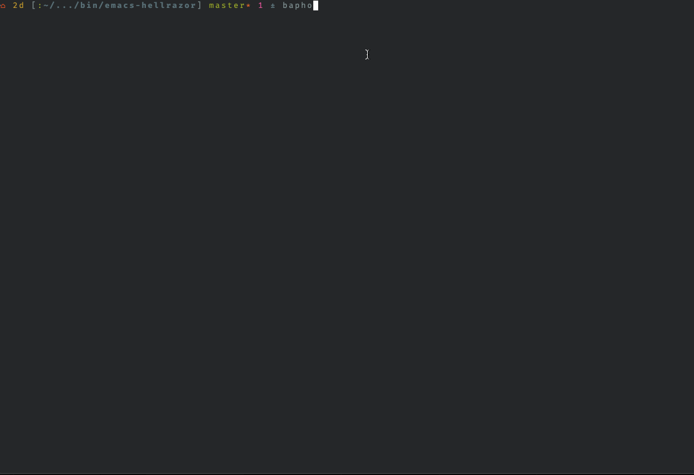

DISCLAIMER -- use at your own peril!

Until I can be sure daemons cannot be killed with unsaved buffers, be extra careful.

Requirement: Aside from requiring bash 4ish, not too sure! (soz).

Developed on `macos 10.13.x` (think, BSD) with `bash 4.4.12(1)-release`.

Believed to work with the following configurations:
* `Bash 4.3.42, Fedora 23`


```text
Usage: baphomet [switches] [arguments]
-h,   --help                      Display (this) help menu
-s,   --start [name[,name2]]      Summon one or more daemons

-k,   --kill,                     Slay one or more daemons
--stop [name[,name2]]
-ka,  --kill-all                  Slay all daemons
--wipe                      Purge the daemon lair
-p,   --prune                     Slay clientless daemons

-j,   --join [name]               Join a daemon with name 'name'
-l,   --list                      List known daemons
-v,   --verbose                   Make output verbose
-vv,  --very-verbose              Make output very verbose

-y,   --list-buffers              List file visiting buffers for
each daemon

-b,   --buffer <name>             Specify buffer name

-i,   --interactive               Interactive mode
-is,  --shell                     Interactive shell mode
-x,   --escape                    Exit script, run emacs as normal
-V,   --version                   Get version of baphomet
-w,   --watch                     Watch mode. Use as first argument

Note:
When called without arguments, baphomet starts a new daemon
if necessary and opens a buffer with a default name.
When called with only a buffer or filename, baphomet joins any daemon
and creates buffer with specified name.

Examples:
- Summon, slay, or join  daemon named 'levi'
$ `baphomet --start|--slay|--join levi`
- Join daemon named 'levi' and open buffer 'justice.txt'
$ `baphomet --join levi -b|-- justice.txt`


Disclaimer: Execute this script at your own peril.

```


2019/11/11
===
`baphomet` will no longer hang when a daemon is unreachable

2019/10/24
===
Partially implemented watch mode: E.G. `baphomet --watch --list-buffers`

2019/10/23
===
Now, if you've `dialog` installed, it'll be used when using interactive mode.


2018/09/29
===
* Using `baphomet -kb|--kill-buffer <buffer-name> <daemon-name>` will allow you to target buffers for killing associated with a given daemon.

2018/09/16
===
* Will now check for and read `.baphomet` is project root. Presently, daemons can be specified.


2018/06/05
===
* Fixed: `baphomet -s -- path/to/file` errors because daemon not assigned name
* Feat: `baphomet -y|--list-buffers` will now list file visiting buffers for each daemon.


2018/06/04
===
You can now kill clientless daemons with `baphomet --prune`!

2018/04/01
===
Now you can join a namespaced daemon (eg this/is/my/project), you can join that daemon by specifying the last segment. Neat! Note that `baphomet` will opt for exact match if one exists.


2018/02/24
===
`Baphomet` will now warn you when you attempt to slay a daemon with file visiting clients, regardless of save status (re `--kill, --kill-all`).


2018/01/27
===
The options `-lv` and `-lvv` not longer work. Prefer `-v -l` and `-vv -l`, respectively, for the same results.


TO-DO
===
* bundling ... ~/bin/baphomet ~/lib/baphomet/*
* being able to parse flags in continuum would be nice
* interactive mode should also list file buffers
* interactive mode should allow buffer name entering
* transparent handling of root owned files
* confirm working with both gnu and bsd variants
* consider usefulness of this `https://www.gnu.org/software/emacs/manual/html_node/elisp/Process-Information.html`
* BUG: dont kill daemons with unsaved buffers
* BUG: commands sent through socket not working when user is root
* option to mark daemons to slay
* `http://graphemica.com/search?page=2&q=braille`
* check if compatible with gui version and xterm
* determine min requirements
* allow/ensure assign user to daemon
* color code path segments in socket path list
* send name of daemon to new frame minibuffer
* jump between daemons
* include image of baphomet
* hm, a universal keyboard using registers or whatever might be nice...
* annotate functions
* suggest daemon names

* ignore this
* `irc//:physikoi@freenode.net#bash`
